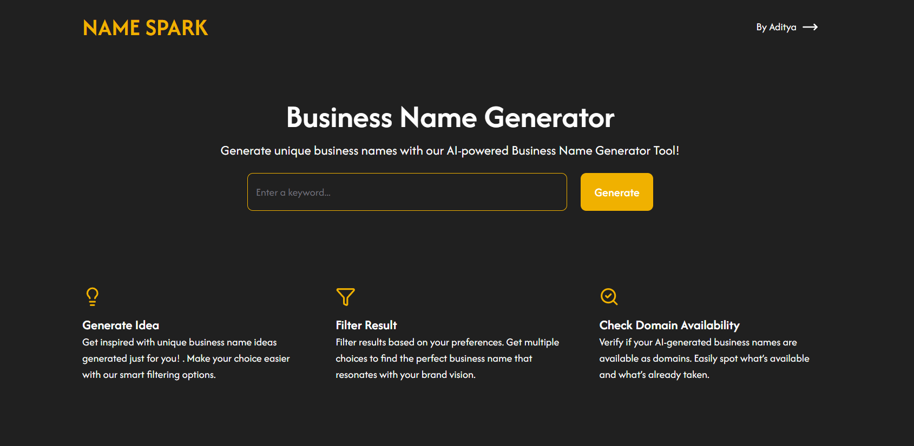
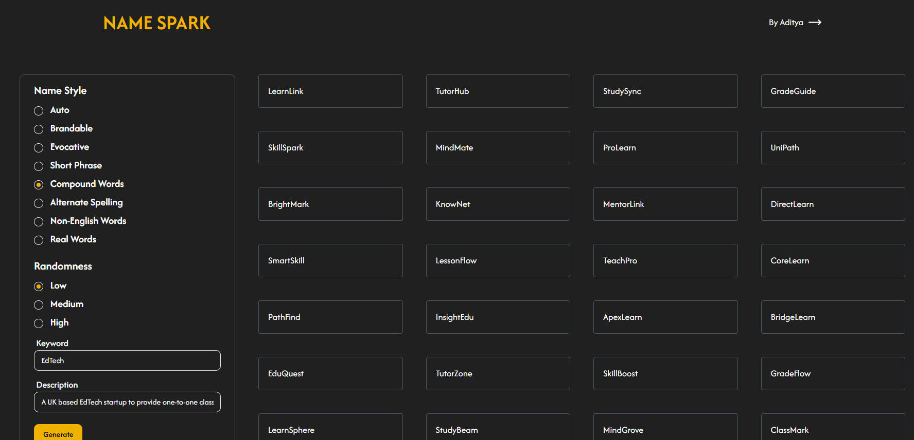
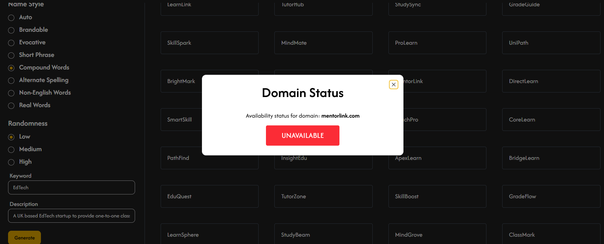

# Name-Spark: Business Name Generator

## Overview

Name-Spark is a modern web application that helps entrepreneurs and businesses generate creative and relevant business names. It provides instant domain status checks and a user-friendly interface to streamline the naming process.

## Features

-   Generate unique business names using Gemini API and dynamic prompts
-   Check domain availability via WhoisXML API
-   Infinite scroll: As you scroll, more business names are generated automatically
-   Intuitive search and filtering options
-   Responsive and clean UI
-   Sidebar navigation and dialogs for enhanced UX
-   Modern UI with ShadCN components and Lucide React icons
-   Styled using Tailwind CSS for rapid and responsive design
-   Global state management using React Context API

## Technologies Used

-   [Next.js](https://nextjs.org/) (App Router)
-   React
-   React Context API (global state management)
-   Tailwind CSS
-   ShadCN (UI components)
-   Lucide React (icons)
-   Gemini API (business name generation)
-   WhoisXML API (domain availability)
-   JavaScript (ES6+)

## APIs

-   **Gemini API**: Generates business names using structured user prompt.
-   **WhoisXML API**: Checks domain availability for suggested names.

## Project Structure

```
components/         # Reusable UI and app components
context/            # React context for business name state
helpers/            # Utility functions and constants
lib/                # Shared libraries (e.g., utils)
public/             # Static assets (SVGs, icons, screenshots)
app/                # Next.js app directory (pages, layouts)
```

## Screenshots







## Getting Started

### Prerequisites

-   Node.js (v18+ recommended)
-   npm or yarn

### Installation

```bash
npm install
```

#### Environment Variables

Create a `.env` file in the project root with your API keys:

```env
NEXT_PUBLIC_GEMINI_API_KEY="your-gemini-api-key"
NEXT_PUBLIC_DOMAIN_STATUS_API="your-whoisxml-api-key"
```

Refer to the official API documentation for details on obtaining keys:

-   [Gemini API](https://ai.google.dev/gemini-api/docs)
-   [WhoisXML Domain Availability API](https://domain-availability.whoisxmlapi.com/api/documentation/making-requests)

### Running the Development Server

```bash
npm run dev
```

Visit [http://localhost:3000](http://localhost:3000) to view the app.

## Usage

1.  Enter keywords and description and select name-style and randomness for your business name.
2.  Browse generated names.
3.  Edit the keywords or selection if required.
4.  Check the domain status.
